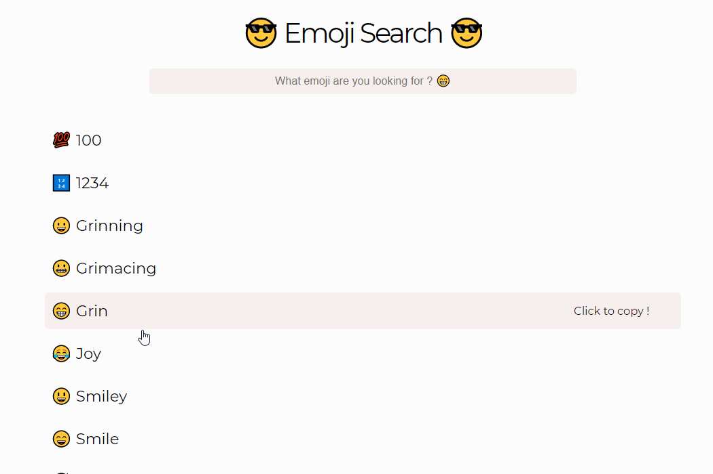

## Emoji Search

This an emoji searcher made with React, you are able to search for the emoji you want !

## Installation

Just run `yarn` in your console to install all dependencies and `yarn start` to launch.

## Features

- Click to copy an emoji and paste it to all your chats 😎

- Search for an emoji with his title or the description of it 😄

## Netlify link

Here you can see and try this project :

https://zmzm-emojisearch.netlify.app/

